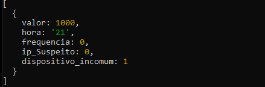
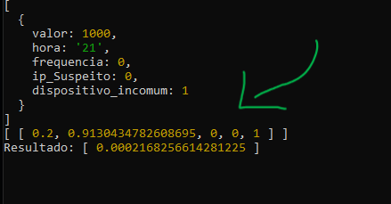
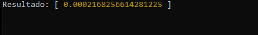
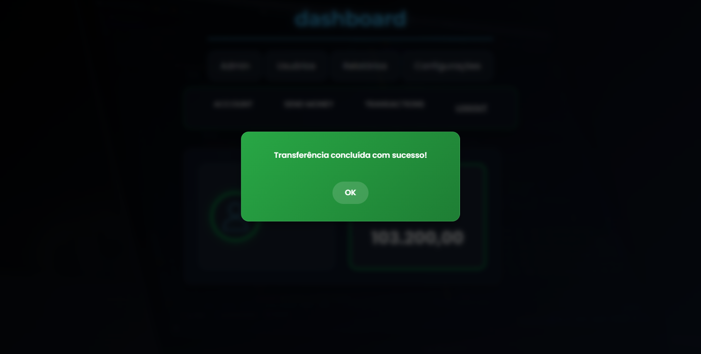
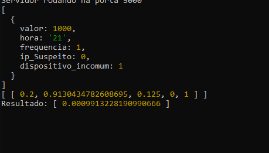
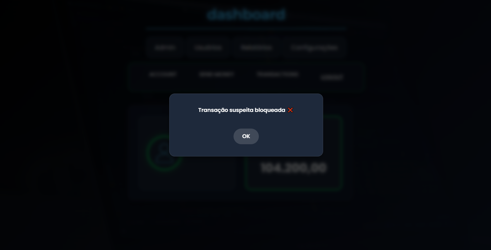
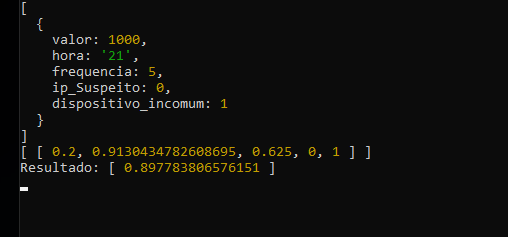

# 🚨 NV-Antifraude
**Sistema inteligente para análise e prevenção de fraudes em transações e logins.**

---

## 📖 Visão Geral
O **NV-Antifraude** nasceu para suprir a falta de sistemas de análise de transações em muitas aplicações, com o objetivo de se tornar futuramente um produto vendável ou até mesmo um **micro SaaS**.

No cenário atual, especialmente em sistemas autônomos e de menor porte, ainda é comum encontrar verificações **manuais** para transações e logins. Isso abre espaço para tentativas de fraude, consumo de tempo e aumento de riscos.

O **NV-Antifraude** (atualmente integrado ao projeto **NOVA-BANK**) atua de forma **100% automática** e **24/7**, analisando logs e detectando tentativas fraudulentas em tempo real, reduzindo drasticamente o número de golpes.

---

## 🛠 Tecnologias Utilizadas

- **Node.js**
- **Express**
- **JSON Web Token**
- **Synaptic** (rede neural)
- **dotenv**
- **CORS**

---

## 🎯 Objetivo do Projeto
Criar uma solução **autônoma** capaz de analisar logs e transações 24 horas por dia, detectando atividades suspeitas e prevenindo golpes.  
No futuro, será adicionado **aprendizado contínuo** para que o sistema evolua sozinho e se adapte a novos padrões de fraude.

---

## 🧠 Como Funciona

O NV-Antifraude segue um fluxo **simples**, mas **poderoso**:

---

### 🔍 1. Coleta dos dados
A IA recebe informações da tentativa de login ou transação:

- `valor` → valor da transação
- `hora` → horário da operação
- `frequencia` → número de tentativas ou transações recentes
- `ip_Suspeito` → se o IP está marcado como suspeito
- `dispositivo_incomum` → se o dispositivo é desconhecido

📷 **Exemplo real de entrada de dados:**  

---

### ⚙️ 2. Processamento
Os dados são **normalizados** para uma escala de `0` a `1`, permitindo que o modelo entenda os valores de forma padronizada.

📷 **Matriz normalizada:**  

---

### 📊 3. Resultado numérico
O modelo retorna um valor entre **0** e **1**:

- **Próximo de 0** → Baixo risco
- **Próximo de 1** → Alto risco

📷 **Exemplo de saída:**  

---

### ✅ 4. Decisão e ação
- **Aprovada** → risco abaixo do limite configurado
- **Bloqueada** → risco acima do limite configurado

📷 **Transação aprovada:**  

📷 **Transação bloqueada:**  

---

## 🔒 Segurança

O **NV-Antifraude** foi desenvolvido com foco em proteção contra acesso não autorizado e manipulação indevida de dados.

**Medidas implementadas:**
- **Autenticação via JWT** – Garante que apenas clientes autorizados possam acessar a API.
- **Chave de API exclusiva** – Cada aplicação integrada possui uma chave única, invalidando acessos não reconhecidos.
- **Validação no backend** – Todos os dados recebidos são verificados para evitar alterações no frontend que possam enganar o sistema.
- **Proteção contra ataques de força bruta** – Tentativas excessivas de autenticação são bloqueadas automaticamente.
- **Análise em tempo real** – Todas as requisições são registradas e analisadas para detectar padrões suspeitos.
- **Bloqueio temporário ou definitivo** – Contas ou transações com risco elevado são automaticamente interrompidas.

📌 **Importante:** O código que conecta a IA antifraude e processa decisões críticas não está disponível publicamente para evitar vulnerabilidades.

---

## 🚀 Status e Acesso

Atualmente, o **NV-Antifraude** está em fase de testes internos e integrado exclusivamente ao **NOVA-BANK**.  
O acesso à API é protegido por **JWT** e **chave de autenticação exclusiva** para a aplicação cliente.  

📌 **Importante:** Não é possível executar o projeto localmente sem credenciais autorizadas.  
Caso queira mais informações ou acesso para integração, entre em contato com o desenvolvedor.

---

## 📅 Roadmap

- [x] Análise de tentativas de login
- [x] Análise de transações
- [ ] Autoaprendizado contínuo
- [ ] Painel web de monitoramento
- [ ] API pública com autenticação segura

