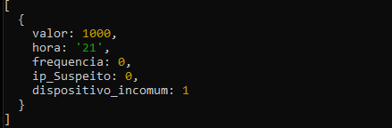
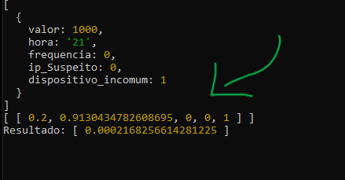
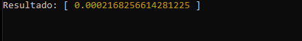
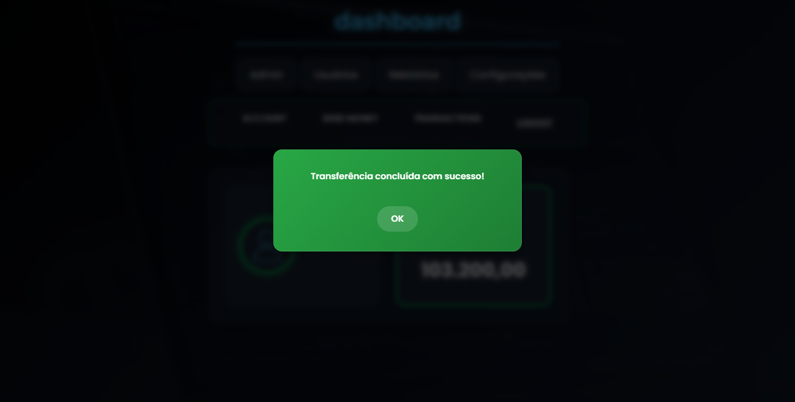
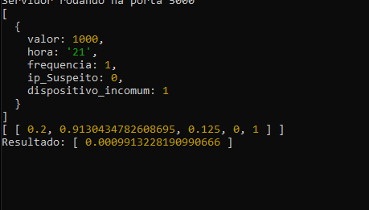
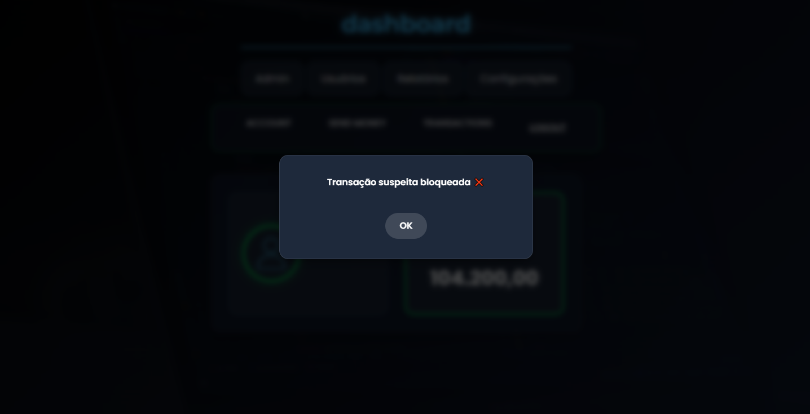
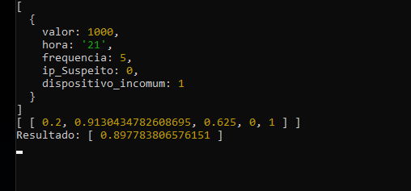

# 🚨 NV-Antifraude
**Sistema inteligente para análise e prevenção de fraudes em transações e logins.**


---

## 📖 Visão Geral
O **NV-Antifraude** nasceu para suprir a falta de sistemas de análise de transações em muitas aplicações, com o objetivo de se tornar futuramente um produto vendável ou até mesmo um **micro SaaS**.

No cenário atual, especialmente em sistemas autônomos e de menor porte, ainda é comum encontrar verificações **manuais** para transações e logins. Isso abre espaço para tentativas de fraude, consumo de tempo e aumento de riscos.

O **NV-Antifraude** (atualmente integrado ao projeto **NOVA-BANK**) atua de forma **100% automática** e **24/7**, analisando logs e detectando tentativas fraudulentas em tempo real, reduzindo drasticamente o número de golpes.

---

## 🛠 Tecnologias Utilizadas

- **Node.js**
- **Express**
- **JSON Web Token**
- **Synaptic** (rede neural)
- **dotenv**
- **CORS**

---

## 🎯 Objetivo do Projeto
Criar uma solução **autônoma** capaz de analisar logs e transações 24 horas por dia, detectando atividades suspeitas e prevenindo golpes.  
No futuro, será adicionado **aprendizado contínuo** para que o sistema evolua sozinho e se adapte a novos padrões de fraude.

---

## 🧠 Como Funciona

O NV-Antifraude segue um fluxo **simples**, mas **poderoso**:


---

### 🔍 1. Coleta dos dados
A IA recebe informações da tentativa de login ou transação:

- `valor` → valor da transação
- `hora` → horário da operação
- `frequencia` → número de tentativas ou transações recentes
- `ip_Suspeito` → se o IP está marcado como suspeito
- `dispositivo_incomum` → se o dispositivo é desconhecido

📷 **Exemplo real de entrada de dados:**  


---

### ⚙️ 2. Processamento
Os dados são **normalizados** para uma escala de `0` a `1`, permitindo que o modelo entenda os valores de forma padronizada.

📷 **Matriz normalizada:**  


---

### 📊 3. Resultado numérico
O modelo retorna um valor entre **0** e **1**:

- **Próximo de 0** → Baixo risco
- **Próximo de 1** → Alto risco

📷 **Exemplo de saída:**  


---

### ✅ 4. Decisão e ação
- **Aprovada** → risco abaixo do limite configurado
- **Bloqueada** → risco acima do limite configurado

📷 **Transação aprovada:**  



📷 **Transação bloqueada:**  



---

## 🔒 Segurança

O **NV-Antifraude** foi desenvolvido com foco em proteção contra acesso não autorizado e manipulação indevida de dados.

**Medidas implementadas:**
- **Autenticação via JWT** – Apenas aplicações com a chave secreta correta conseguem consumir a API.
- **Validação no backend** – Todos os dados recebidos são verificados para evitar alterações no frontend que possam enganar o sistema.
- **Proteção contra ataques de força bruta** – Tentativas excessivas de autenticação são bloqueadas automaticamente.
- **Análise em tempo real** – Todas as requisições são registradas e analisadas para detectar padrões suspeitos.
- **Bloqueio temporário ou definitivo** – Contas ou transações com risco elevado são automaticamente interrompidas.

📌 **Importante:** O código que conecta a IA antifraude e processa decisões críticas não está disponível publicamente para evitar vulnerabilidades.

---


---

## 🚀 Instalação

### Pré-requisitos

- Node.js 18+
- NPM
- Projeto NV-BANK (opcional, mas recomendado para testes completos)

---

### 1. Clone o repositório

```bash
git clone https://github.com/Edu-devCodes/NV-antifraude.git
```

---

### 2. Instale as dependências

```bash
npm install
```

---

### 3. Configure as variáveis de ambiente

Crie um arquivo:

```txt
server/.env
```

Utilize o seguinte modelo:

```env
JWT_SECRET=sua_chave_secreta
```

⚠️ Importante:

A variável `JWT_SECRET` deve possuir exatamente o mesmo valor utilizado no projeto NV-BANK.

Essa chave é utilizada para validar os tokens JWT enviados pelo cliente e impedir requisições não autorizadas.

---

### 4. Inicie o servidor

Entre na pasta:

```bash
cd server
```

Execute:

```bash
node server.js
```

Se tudo estiver correto, você verá:

```txt
Servidor rodando na porta 5000
```

---

### 5. Testando integração com NV-BANK

Para testar o fluxo completo de login e transferências, configure também o projeto:

https://github.com/Edu-devCodes/NV-BANK

O NV-BANK envia os dados para o NV-Antifraude durante:

- Tentativas de login
- Transferências financeiras

permitindo que a IA realize análises em tempo real.

---
## 🏗 Arquitetura

```txt
NV-BANK
   ↓
JWT Authentication
   ↓
NV-Antifraude API
   ↓
Normalização dos dados
   ↓
Rede Neural (Synaptic)
   ↓
Score de risco
   ↓
Aprovar ou Bloquear
```

## 🧠 Sobre o Modelo

📌 Observação:

O treinamento do modelo não é necessário para executar o projeto.
A versão disponibilizada neste repositório já possui pesos treinados e está pronta para testes locais.

O objetivo deste projeto é demonstrar o funcionamento da integração antifraude e do processo de análise de risco.

Versões futuras incluirão:

- Re-treinamento automatizado
- Aprendizado contínuo
- Novas variáveis comportamentais
- Painel de monitoramento dos resultados (atualmente apenas via terminal)

## 📅 Roadmap

- [x] Análise de tentativas de login
- [x] Análise de transações
- [ ] Autoaprendizado contínuo
- [ ] Painel web de monitoramento
- [ ] API pública com autenticação segura


